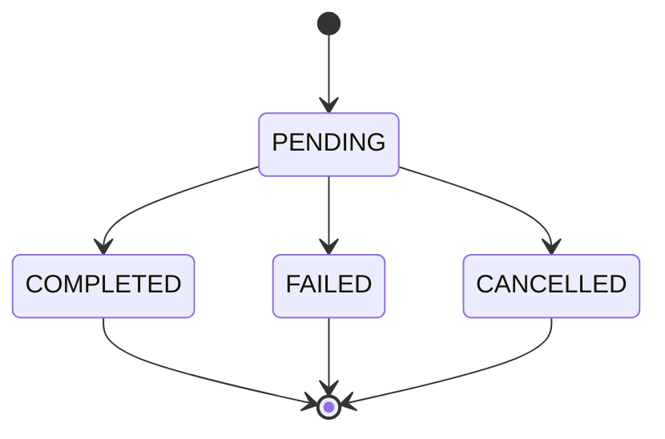

# API

## Información general

| Atributo | Valor |
|----------|-------|
| Base URL (local) | `http://localhost:8080` |
| Formato | JSON |
| Versión | `v1` (pendiente de definir prefijo) |

!!! info "Estado actual"
    El servicio se encuentra en fase de scaffolding. Los endpoints descritos a continuación representan el contrato objetivo del microservicio.

## Endpoints

### Crear pago

`POST /api/v1/payments`

**Request body:**

```json
{
  "orderId": "ord-12345",
  "userId": "usr-67890",
  "amount": 150000.00,
  "currency": "COP",
  "method": "CREDIT_CARD"
}
```

**Response `201 Created`:**

```json
{
  "id": "pay-abc123",
  "orderId": "ord-12345",
  "userId": "usr-67890",
  "amount": 150000.00,
  "currency": "COP",
  "status": "PENDING",
  "createdAt": "2026-07-13T16:00:00Z"
}
```

---

### Consultar pago por ID

`GET /api/v1/payments/{id}`

**Response `200 OK`:**

```json
{
  "id": "pay-abc123",
  "orderId": "ord-12345",
  "userId": "usr-67890",
  "amount": 150000.00,
  "currency": "COP",
  "status": "COMPLETED",
  "createdAt": "2026-07-13T16:00:00Z",
  "updatedAt": "2026-07-13T16:05:00Z"
}
```

---

### Listar pagos por usuario

`GET /api/v1/payments?userId={userId}`

**Response `200 OK`:**

```json
[
  {
    "id": "pay-abc123",
    "orderId": "ord-12345",
    "amount": 150000.00,
    "currency": "COP",
    "status": "COMPLETED"
  }
]
```

---

### Actualizar estado de pago

`PATCH /api/v1/payments/{id}/status`

**Request body:**

```json
{
  "status": "COMPLETED"
}
```

**Response `200 OK`:**

```json
{
  "id": "pay-abc123",
  "status": "COMPLETED",
  "updatedAt": "2026-07-13T16:05:00Z"
}
```

## Códigos de respuesta

| Código | Descripción |
|--------|-------------|
| `200` | Operación exitosa |
| `201` | Recurso creado |
| `400` | Solicitud inválida |
| `404` | Pago no encontrado |
| `409` | Conflicto de estado |
| `500` | Error interno del servidor |

## Modelo de estados



## Convenciones

- Los identificadores son strings opacos generados por el servicio.
- Los montos se expresan como números decimales con dos decimales de precisión.
- Las fechas siguen el formato ISO 8601 en UTC.
