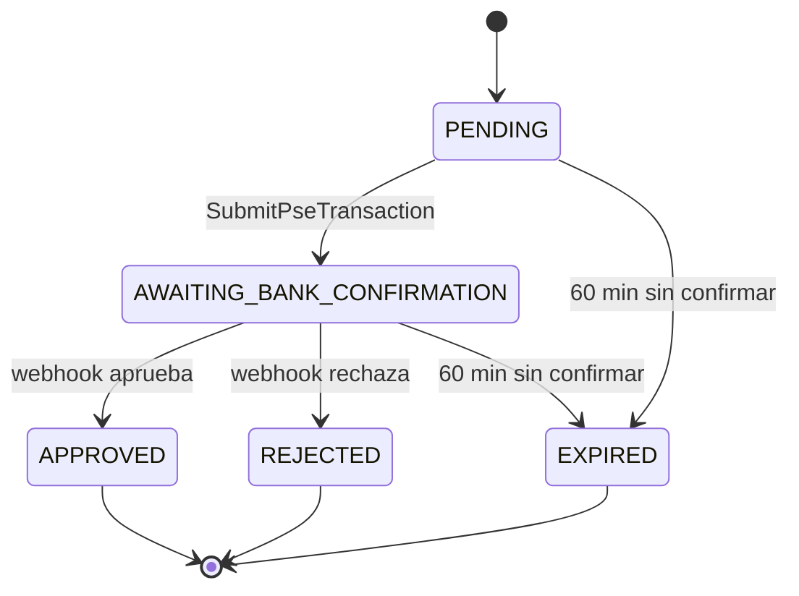

# API

## Información general

| Atributo | Valor |
|----------|-------|
| Base URL (local) | `http://localhost:8080` |
| Formato | JSON |
| Documentación interactiva | `/swagger-ui.html` (Swagger UI) · `/v3/api-docs` (OpenAPI JSON) |

!!! info "Contrato con Tournament Service"
    `GET /payment-orders/{enrollmentId}` y `POST /payment-orders` ya son consumidos por `mk-tournament-service` (`PaymentServiceClientAdapter`). Cambiar el nombre de un campo de respuesta, aunque sea de mayúsculas a minúsculas, rompe ese consumidor en silencio — su adaptador nunca lanza excepción, solo degrada a `UNKNOWN`.

## Endpoints

### Crear orden de pago — TC-PAY-01

`POST /payment-orders`

**Request body:**

```json
{
  "enrollmentId": "enr-12345",
  "teamId": "team-001",
  "tournamentId": "torneo-2026",
  "amount": 50000.00
}
```

**Response `201 Created`:**

```json
{
  "paymentOrderId": "b3f1c2a0-1234-4a5b-9c0d-abc123456789",
  "status": "PENDING",
  "expiresAt": "2026-07-13T21:00:00"
}
```

**Errores:**

| Código | Causa |
|--------|-------|
| `400` | Body inválido (campos faltantes, `amount` ≤ 0) |
| `409` | Ya existe una orden para ese `enrollmentId` |
| `422` | El monto está fuera del rango permitido por Mercado Pago para PSE |

---

### Enviar transacción PSE — TC-PAY-02

`POST /payment-orders/{enrollmentId}/pse`

**Request body:**

```json
{
  "financialInstitution": "1007",
  "payerEmail": "pagador@correo.com",
  "identificationType": "CC",
  "identificationNumber": "123456789",
  "entityType": "individual",
  "firstName": "Juan",
  "lastName": "Pérez",
  "addressZipCode": "11001",
  "addressStreetName": "Calle 1",
  "addressStreetNumber": "123",
  "addressNeighborhood": "Centro",
  "addressCity": "Bogotá",
  "phoneAreaCode": "601",
  "phoneNumber": "12345"
}
```

`firstName`, `lastName`, la dirección y el teléfono son obligatorios: Mercado Pago los exige para crear un pago PSE desde el 31/12/2024. El Payment Brick (repo de frontend, fuera de este servicio) no los recoge por sí solo — el checkout necesita un formulario propio adicional al `onSubmit` del Brick para completarlos.

`additional_info.ip_address`, requerido también por Mercado Pago, **no** viaja en este body: el backend lo captura del propio request HTTP (cabecera `X-Forwarded-For`, o la IP del socket si no hay proxy) para evitar que un cliente lo falsifique.

**Response `200 OK`:**

```json
{
  "status": "AWAITING_BANK_CONFIRMATION",
  "externalResourceUrl": "https://www.mercadopago.com/pse/ticket/..."
}
```

**Errores:**

| Código | Causa |
|--------|-------|
| `400` | Body inválido |
| `404` | No existe una orden para ese `enrollmentId` |
| `409` | La orden no está en estado `PENDING` |
| `410` | La orden ya expiró (se persiste la expiración en el mismo request) |
| `502` | Mercado Pago rechazó la solicitud — la orden queda en `PENDING` para reintento |

!!! info "callback-url vs. notification-url"
    Este endpoint envía a Mercado Pago dos URLs distintas, configuradas por separado (`mercadopago.callback-url` y `mercadopago.notification-url`): `callback_url` es una URL del **frontend** a la que Mercado Pago redirige al pagador después de autenticarse con su banco, para que el Payment/Status Screen Brick lea `payment_id` de la query string; `notification_url` es el webhook de **este backend** (`POST /payment-orders/webhook`, TC-PAY-03). No deben apuntar al mismo lugar.

---

### Webhook de Mercado Pago — TC-PAY-03

`POST /payment-orders/webhook`

**Request body (enviado por Mercado Pago):**

```json
{
  "action": "payment.updated",
  "type": "payment",
  "data": { "id": "1234567890" }
}
```

**Response:** siempre `204 No Content`, incluso si `data.id` no corresponde a ninguna orden — Mercado Pago reintenta ante cualquier código de error, así que este endpoint nunca falla.

!!! danger "Nunca se confía en el body"
    El único dato que se usa del body es `data.id`. El estado real del pago se obtiene siempre llamando a la API de Mercado Pago (`GET /v1/payments/{id}`) — cualquier campo de estado que llegara en este body se ignora por diseño.

---

### Consultar estado de una orden — TC-PAY-04

`GET /payment-orders/{enrollmentId}`

**Response `200 OK`:**

```json
{
  "status": "APPROVED"
}
```

**Errores:**

| Código | Causa |
|--------|-------|
| `404` | No existe una orden para ese `enrollmentId` |

---

### Consultar límites de PSE — TC-PAY-06

`GET /payment-methods/limits?amount={amount}`

**Response `200 OK`:**

```json
{
  "valid": true,
  "minAllowedAmount": 10000.00,
  "maxAllowedAmount": 500000.00
}
```

**Errores:**

| Código | Causa |
|--------|-------|
| `404` | Aún no se ha ejecutado la sincronización de límites (`SyncPaymentMethodsJob`, corre diario) |

## Códigos de respuesta

| Código | Descripción |
|--------|-------------|
| `200` | Operación exitosa |
| `201` | Orden de pago creada |
| `204` | Webhook procesado (siempre, sin importar el resultado interno) |
| `400` | Body inválido (validación de Bean Validation) |
| `404` | Orden de pago o límites de método de pago no encontrados |
| `409` | Conflicto de estado (duplicado o transición inválida) |
| `410` | La orden ya expiró |
| `422` | Monto fuera de los límites permitidos |
| `502` | Mercado Pago rechazó o no respondió la solicitud |

## Modelo de estados



!!! note "EXPIRED es interno"
    `EXPIRED` nunca se serializa tal cual en la API pública — `GetPaymentOrderStatus` lo mapea a `"REJECTED"` en la respuesta. El dominio y la base de datos conservan `EXPIRED` para auditoría interna.

## Convenciones

- Los identificadores de orden (`paymentOrderId`) son UUID generados por este servicio.
- Los montos se expresan como números decimales con dos decimales de precisión (persistidos como `Decimal128` en MongoDB).
- Las fechas siguen `LocalDateTime` en formato ISO 8601 sin zona horaria explícita.
- `enrollmentId` es el identificador opaco que provee `mk-tournament-service`; una orden por `enrollmentId`.
