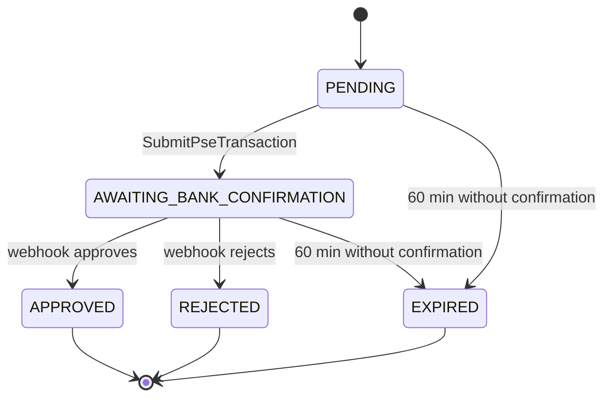

# API

## Overview

The service exposes a single **REST API** for two purposes: managing payment orders (create, submit PSE, query status) and querying PSE payment method limits — plus the inbound webhook Mercado Pago uses to notify payment results. There is no WebSocket or streaming interface; every interaction is a synchronous HTTP request/response.

It is documented with **springdoc-openapi**: once the app is running, the interactive Swagger UI is available at `/swagger-ui.html` (raw spec at `/v3/api-docs`). Every endpoint below is described exactly as it appears there — same summaries, same request/response examples — just grouped by resource and written out in plain language.

Endpoints are grouped into two resources, matching the OpenAPI tags: **Payment Orders** (`/payment-orders`) and **Payment Methods** (`/payment-methods`). None of them currently require authentication.

## General Information

| Attribute | Value |
|-----------|-------|
| Base URL (local) | `http://localhost:8080` |
| Format | JSON |
| Interactive documentation | `/swagger-ui.html` (Swagger UI) · `/v3/api-docs` (OpenAPI JSON) |

!!! info "Contract with Tournament Service"
    `GET /payment-orders/{enrollmentId}` and `POST /payment-orders` are already consumed by `mk-tournament-service` (`PaymentServiceClientAdapter`). Renaming a response field, even just changing its casing, silently breaks that consumer — its adapter never throws an exception, it just degrades to `UNKNOWN`.

## Endpoints

### Create payment order — TC-PAY-01

`POST /payment-orders`

**Request body:**

```json
{
  "enrollmentId": "enr-12345",
  "teamId": "team-001",
  "tournamentId": "torneo-2026",
  "amount": 50000.00
}
```

**Response `201 Created`:**

```json
{
  "paymentOrderId": "b3f1c2a0-1234-4a5b-9c0d-abc123456789",
  "status": "PENDING",
  "expiresAt": "2026-07-13T21:00:00"
}
```

**Errors:**

| Code | Cause |
|------|-------|
| `400` | Invalid body (missing fields, `amount` ≤ 0) |
| `409` | An order already exists for that `enrollmentId` |
| `422` | The amount is outside the range allowed by Mercado Pago for PSE |

---

### Submit PSE transaction — TC-PAY-02

`POST /payment-orders/{enrollmentId}/pse`

**Request body:**

```json
{
  "financialInstitution": "1007",
  "payerEmail": "pagador@correo.com",
  "identificationType": "CC",
  "identificationNumber": "123456789",
  "entityType": "individual",
  "firstName": "Juan",
  "lastName": "Pérez",
  "addressZipCode": "11001",
  "addressStreetName": "Calle 1",
  "addressStreetNumber": "123",
  "addressNeighborhood": "Centro",
  "addressCity": "Bogotá",
  "phoneAreaCode": "601",
  "phoneNumber": "12345"
}
```

`firstName`, `lastName`, the address, and the phone number are mandatory: Mercado Pago has required them to create a PSE payment since 12/31/2024. The Payment Brick (frontend repo, outside this service) does not collect them on its own — the checkout needs an additional form on top of the Brick's `onSubmit` to complete them.

`additional_info.ip_address`, also required by Mercado Pago, does **not** travel in this body: the backend captures it from the HTTP request itself (`X-Forwarded-For` header, or the socket IP if there is no proxy) to prevent a client from spoofing it.

**Response `200 OK`:**

```json
{
  "status": "AWAITING_BANK_CONFIRMATION",
  "externalResourceUrl": "https://www.mercadopago.com/pse/ticket/..."
}
```

**Errors:**

| Code | Cause |
|------|-------|
| `400` | Invalid body |
| `404` | No order exists for that `enrollmentId` |
| `409` | The order is not in `PENDING` state |
| `410` | The order has already expired (the expiration is persisted in the same request) |
| `502` | Mercado Pago rejected the request — the order stays in `PENDING` for retry |

!!! info "callback-url vs. notification-url"
    This endpoint sends Mercado Pago two distinct URLs, configured separately (`mercadopago.callback-url` and `mercadopago.notification-url`): `callback_url` is a **frontend** URL that Mercado Pago redirects the payer to after authenticating with their bank, so the Payment/Status Screen Brick can read `payment_id` from the query string; `notification_url` is **this backend's** webhook (`POST /payment-orders/webhook`, TC-PAY-03). They must not point to the same place.

---

### Mercado Pago webhook — TC-PAY-03

`POST /payment-orders/webhook`

**Request body (sent by Mercado Pago):**

```json
{
  "action": "payment.updated",
  "type": "payment",
  "data": { "id": "1234567890" }
}
```

**Response:** always `204 No Content`, even if `data.id` does not match any order — Mercado Pago retries on any error code, so this endpoint never fails.

!!! danger "The body is never trusted"
    The only data used from the body is `data.id`. The actual payment status is always obtained by calling the Mercado Pago API (`GET /v1/payments/{id}`) — any status field arriving in this body is ignored by design.

---

### Get payment order status — TC-PAY-04

`GET /payment-orders/{enrollmentId}`

**Response `200 OK`:**

```json
{
  "status": "APPROVED"
}
```

**Errors:**

| Code | Cause |
|------|-------|
| `404` | No order exists for that `enrollmentId` |

---

### Get PSE limits — TC-PAY-06

`GET /payment-methods/limits?amount={amount}`

**Response `200 OK`:**

```json
{
  "valid": true,
  "minAllowedAmount": 10000.00,
  "maxAllowedAmount": 500000.00
}
```

**Errors:**

| Code | Cause |
|------|-------|
| `404` | The payment method limits sync (`SyncPaymentMethodsJob`, runs daily) has not run yet |

## Response Codes

| Code | Description |
|------|-------------|
| `200` | Successful operation |
| `201` | Payment order created |
| `204` | Webhook processed (always, regardless of internal outcome) |
| `400` | Invalid body (Bean Validation) |
| `404` | Payment order or payment method limits not found |
| `409` | State conflict (duplicate or invalid transition) |
| `410` | The order has already expired |
| `422` | Amount outside the allowed limits |
| `502` | Mercado Pago rejected or did not respond to the request |

## State Model



!!! note "EXPIRED is internal"
    `EXPIRED` is never serialized as-is in the public API — `GetPaymentOrderStatus` maps it to `"REJECTED"` in the response. The domain and the database keep `EXPIRED` for internal auditing.

## Conventions

- Order identifiers (`paymentOrderId`) are UUIDs generated by this service.
- Amounts are expressed as decimal numbers with two decimal places of precision (persisted as `NUMERIC(19,2)` in PostgreSQL).
- Dates follow `LocalDateTime` in ISO 8601 format with no explicit time zone.
- `enrollmentId` is the opaque identifier provided by `mk-tournament-service`; one order per `enrollmentId`.
