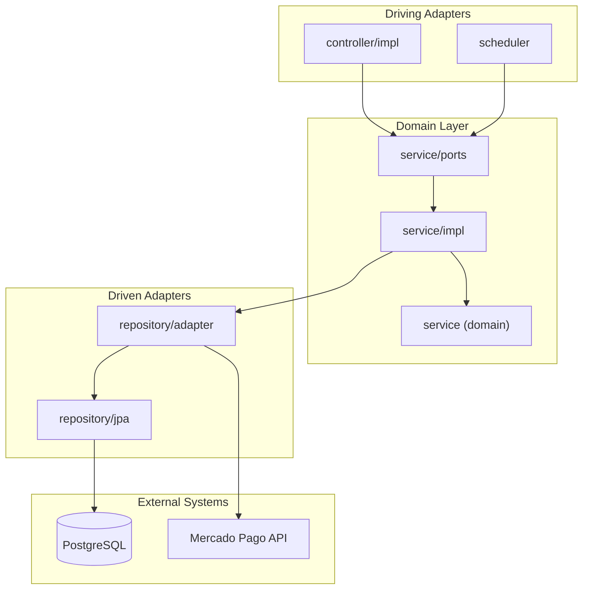

# Architecture

## Overview

The service follows a **hexagonal architecture** (Ports & Adapters), separating business logic from infrastructure concerns.



## Package Structure

```
src/main/java/co/edu/escuelaing/techcup/payment/
├── config/                     ← CONFIG LAYER (Scheduling, infrastructure beans)
├── controller/impl/            ← DRIVING ADAPTERS (@RestController)
├── scheduler/                  ← DRIVING ADAPTERS triggered by time (@Scheduled)
├── dto/                        ← DATA TRANSFER OBJECTS
│   ├── request/                (Records for HTTP Requests)
│   └── response/               (Records for HTTP Responses)
├── entity/                     ← PERSISTENCE LAYER (JPA Entities)
├── exception/                  ← SYSTEM EXCEPTIONS
├── mapper/                     ← Static classes: domain↔entity, domain↔DTO
├── repository/                 ← REPOSITORIES & ADAPTERS
│   ├── jpa/                    (Spring Data JPA Repository interfaces)
│   └── adapter/                (Outbound Ports Implementation: PostgreSQL + Mercado Pago)
├── service/                    ← DOMAIN / CORE LAYER
│   ├── ports/                  (Inbound/Outbound Interfaces)
│   └── impl/                   (Use Cases and Business Rules)
└── PaymentApplication.java
```

## Layer Responsibilities

| Layer | Package | Responsibility |
|-------|---------|----------------|
| Config | `config` | Beans, scheduling, global configuration |
| Driving (HTTP) | `controller/impl` | Expose HTTP endpoints, validate input |
| Driving (cron) | `scheduler` | Trigger use cases by time instead of HTTP |
| DTO | `dto` | Input and output API contracts |
| Entity | `entity` | JPA persistence models |
| Exception | `exception` | Domain exceptions and global handlers |
| Mapper | `mapper` | Conversion between DTO, domain, and entities |
| Repository | `repository` | Data access and outbound port implementations |
| Service | `service` | Business rules and use cases |

## Request Flow

1. The HTTP client invokes an endpoint in `controller/impl` (or a cron triggers a job in `scheduler`).
2. The controller/job delegates to the corresponding inbound port in `service/ports` (`XxxUseCase`).
3. `service/impl` executes application rules, delegating business rules of the aggregate to the domain (`service`, root package).
4. If persistence is required, the outbound port (`XxxRepositoryPort`) is invoked, implemented in `repository/adapter`, which uses `repository/jpa` to communicate with PostgreSQL via Spring Data JPA.
5. If Mercado Pago communication is needed, `PaymentGatewayPort` is invoked, implemented by `MercadoPagoGatewayAdapter` via `RestClient`.
6. The result is mapped to a response DTO (`mapper/XxxRestMapper`) and returned to the client.

## Design Principles

- **Dependency Inversion**: the domain does not depend on Spring, PostgreSQL, or HTTP.
- **Single Responsibility**: each layer has a clear responsibility.
- **Testability**: use cases can be tested without starting the full web context.
- **Independent Evolution**: adapters can change without affecting the domain.

## Database Tables


