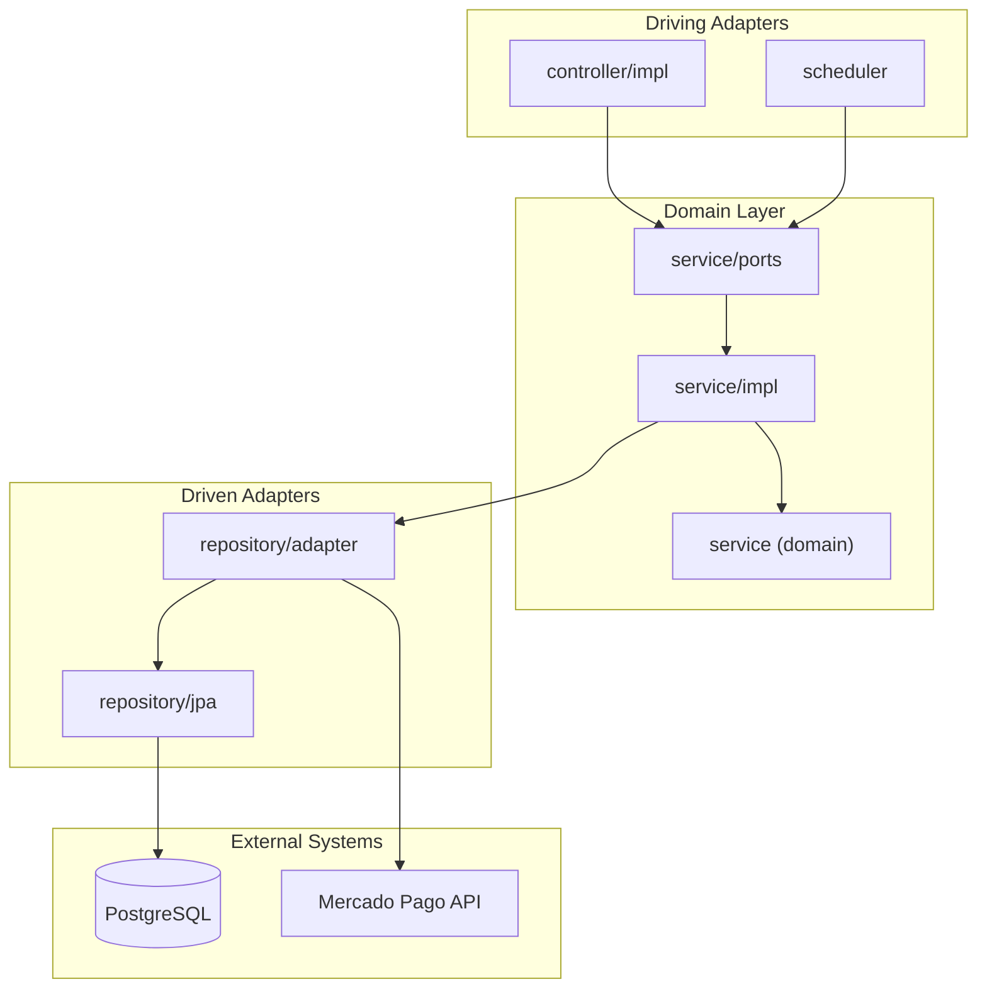
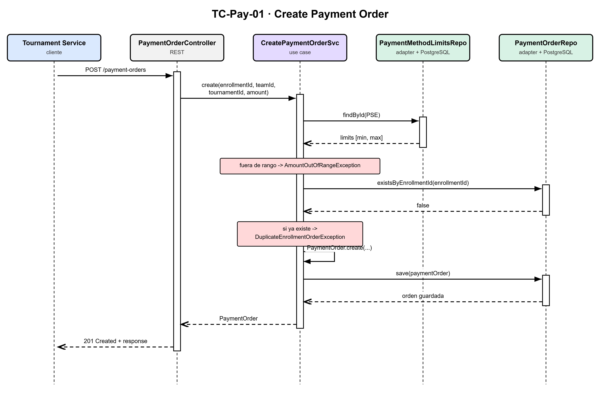
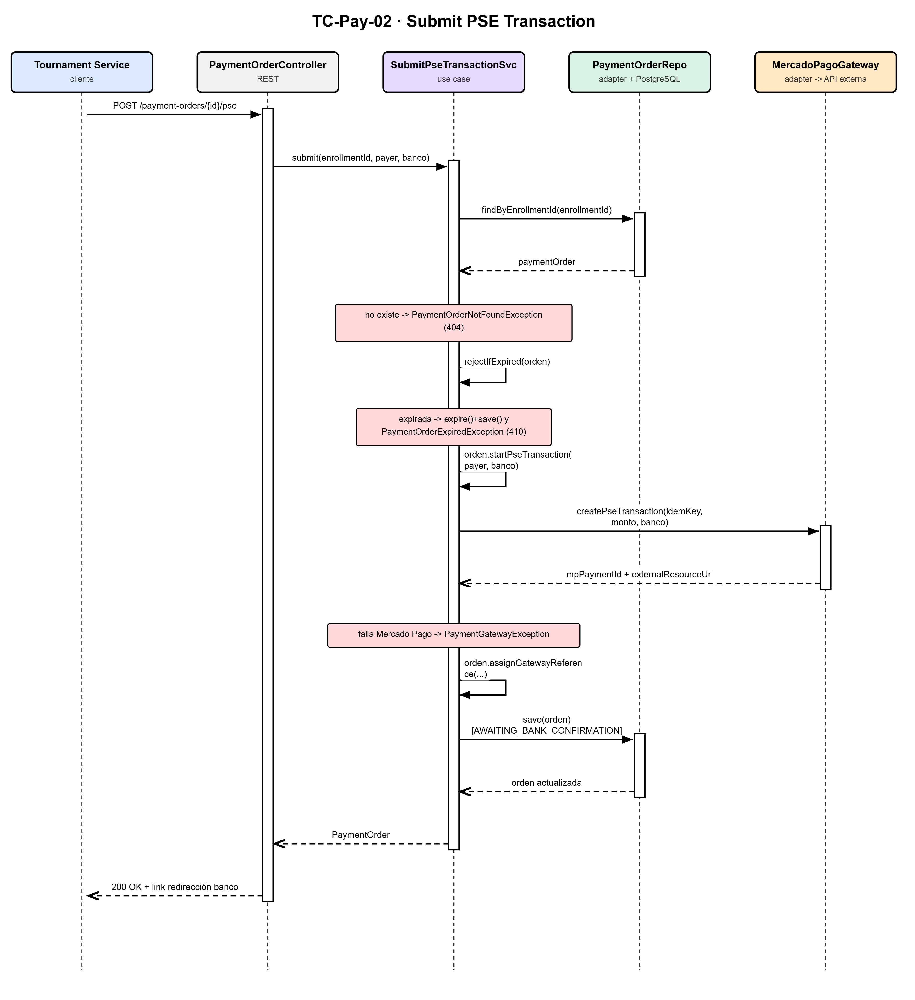
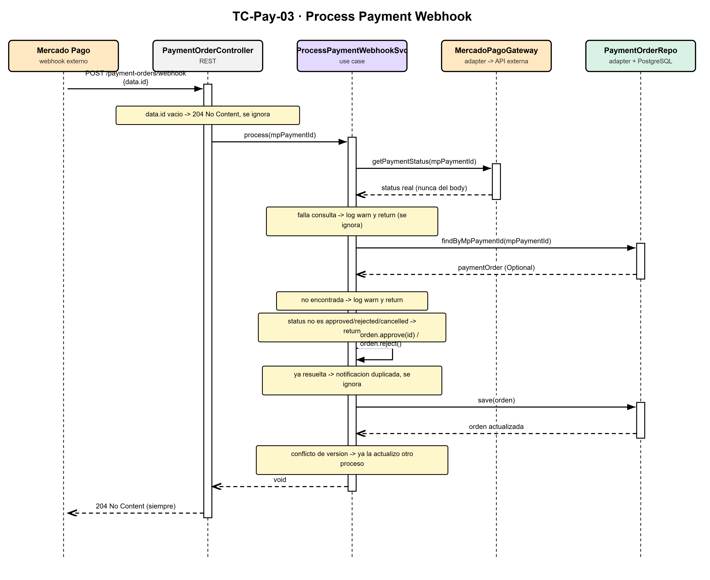
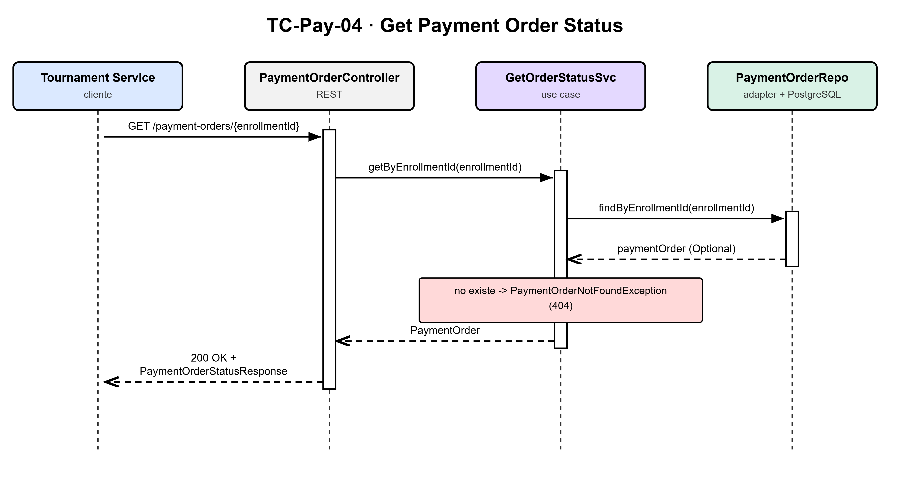
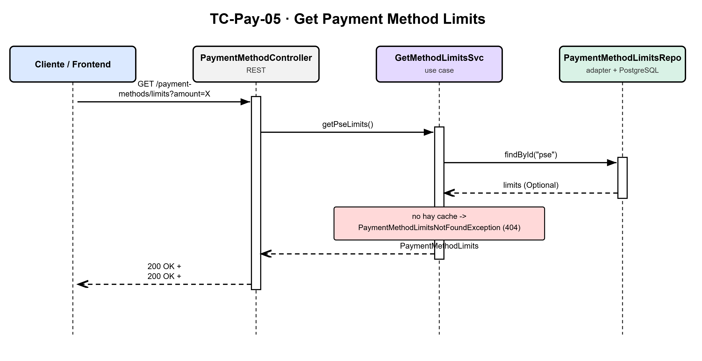

# Architecture

## System architecture

The service follows a **hexagonal architecture** (Ports & Adapters), separating business logic from infrastructure concerns: the domain never depends on Spring, PostgreSQL, or HTTP.



## Architecture decisions

### Why REST, not WebSocket?

A payment order goes through very few state transitions (`PENDING` → `AWAITING_BANK_CONFIRMATION` → `APPROVED`/`REJECTED`/`EXPIRED`), and nothing in this service needs to push updates to a client in real time. The frontend's Status Screen Brick and `mk-tournament-service` simply poll `GET /payment-orders/{enrollmentId}`, and Mercado Pago itself notifies status changes with a plain HTTP webhook (`POST /payment-orders/webhook`) instead of a persistent connection. Keeping everything as stateless request/response REST avoids the operational cost of holding open connections and keeps the service trivially scalable horizontally (see RNF-02 in [Requirements](requirements.md)).

### Why PostgreSQL and not NoSQL?

Payment orders are money-bearing records with a small, fixed, well-understood shape and strict consistency requirements: two concurrent updates to the same order (e.g. a webhook notification racing the expiration job) must not both succeed silently. PostgreSQL's transactions and the `version` column (`@Version`, optimistic locking) give that guarantee directly. Flyway migrations also make schema evolution explicit and auditable — properties a schemaless document store would trade away for flexibility this domain doesn't need.

### Inter-service communication: REST

All communication in this system is synchronous HTTP, in both directions — there is no message broker or event bus:

- **Inbound:** `mk-tournament-service` calls this service's REST API directly (`POST /payment-orders`, `GET /payment-orders/{enrollmentId}`).
- **Outbound:** this service calls Mercado Pago's REST API (`/v1/payments`, `/v1/payment_methods`) via `RestClient`.

See [Service Integration](service-integration.md) for the full picture of both integrations.

## Design patterns

- **Ports & Adapters (Hexagonal Architecture):** inbound ports (`XxxUseCase`) are implemented by `service/impl`; outbound ports (`XxxRepositoryPort`, `PaymentGatewayPort`) are implemented by `repository/adapter`.
- **Repository pattern:** `repository/jpa` wraps Spring Data JPA; `repository/adapter` adapts it (and Mercado Pago) to the domain's outbound ports.
- **Mapper pattern:** static mapper classes (`mapper/`) handle all domain↔entity and domain↔DTO conversion, keeping that logic out of services and controllers.
- **Scheduled Job pattern:** `scheduler/` triggers use cases by time (`ExpireTransaction`, `SyncPaymentMethods`) through the same inbound ports the HTTP controllers use, instead of duplicating logic.

Design principles behind these choices: dependency inversion (domain has no framework dependencies), single responsibility per layer, testability (use cases are tested without a Spring context), and independent evolution of adapters.

## Components

```
src/main/java/co/edu/escuelaing/techcup/payment/
├── config/                     ← CONFIG LAYER (Scheduling, infrastructure beans)
├── controller/impl/            ← DRIVING ADAPTERS (@RestController)
├── scheduler/                  ← DRIVING ADAPTERS triggered by time (@Scheduled)
├── dto/                        ← DATA TRANSFER OBJECTS
│   ├── request/                (Records for HTTP Requests)
│   └── response/               (Records for HTTP Responses)
├── entity/                     ← PERSISTENCE LAYER (JPA Entities)
├── exception/                  ← SYSTEM EXCEPTIONS
├── mapper/                     ← Static classes: domain↔entity, domain↔DTO
├── repository/                 ← REPOSITORIES & ADAPTERS
│   ├── jpa/                    (Spring Data JPA Repository interfaces)
│   └── adapter/                (Outbound Ports Implementation: PostgreSQL + Mercado Pago)
├── service/                    ← DOMAIN / CORE LAYER
│   ├── ports/                  (Inbound/Outbound Interfaces)
│   └── impl/                   (Use Cases and Business Rules)
└── PaymentApplication.java
```

| Layer | Package | Responsibility |
|-------|---------|-----------------|
| Config | `config` | Beans, scheduling, global configuration |
| Driving (HTTP) | `controller/impl` | Expose HTTP endpoints, validate input |
| Driving (cron) | `scheduler` | Trigger use cases by time instead of HTTP |
| DTO | `dto` | Input and output API contracts |
| Entity | `entity` | JPA persistence models |
| Exception | `exception` | Domain exceptions and global handlers |
| Mapper | `mapper` | Conversion between DTO, domain, and entities |
| Repository | `repository` | Data access and outbound port implementations |
| Service | `service` | Business rules and use cases |

## General flow

1. The HTTP client invokes an endpoint in `controller/impl` (or a cron triggers a job in `scheduler`).
2. The controller/job delegates to the corresponding inbound port in `service/ports` (`XxxUseCase`).
3. `service/impl` executes application rules, delegating business rules of the aggregate to the domain (`service`, root package).
4. If persistence is required, the outbound port (`XxxRepositoryPort`) is invoked, implemented in `repository/adapter`, which uses `repository/jpa` to communicate with PostgreSQL via Spring Data JPA.
5. If Mercado Pago communication is needed, `PaymentGatewayPort` is invoked, implemented by `MercadoPagoGatewayAdapter` via `RestClient`.
6. The result is mapped to a response DTO (`mapper/XxxRestMapper`) and returned to the client.

## UML and architecture diagrams

General component view of the service:


Detailed view of components and their responsibilities:


## Diagrams

Sequence diagrams for each REST use case:

| Use case | Diagram |
|----------|---------|
| TC-PAY-01 — Create payment order |  |
| TC-PAY-02 — Submit PSE transaction |  |
| TC-PAY-03 — Process payment webhook |  |
| TC-PAY-04 — Get payment order status |  |
| TC-PAY-06 — Get payment method limits |  |

Database tables:


