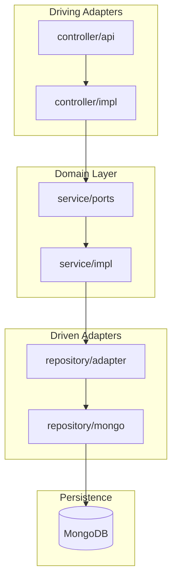

# Arquitectura

## Visión general

El servicio sigue una **arquitectura hexagonal** (Ports & Adapters), separando la lógica de negocio de los detalles de infraestructura.



## Estructura de paquetes

```
src/main/java/co/edu/escuelaing/techcup/payment/
├── config/                     ← CONFIG LAYER (CORS, Virtual Threads...)
├── controller/                 ← DRIVING ADAPTERS (Entry Layer)
│   ├── api/                    (@RequestMapping Interfaces)
│   └── impl/                   (@RestController Implementations)
├── dto/                        ← DATA TRANSFER OBJECTS
│   ├── request/                (Records for HTTP Requests)
│   └── response/               (Records for HTTP Responses)
├── entity/                     ← PERSISTENCE LAYER (DB Models)
│   ├── relational/             (JPA Entities)
│   └── document/               (MongoDB Documents)
├── exception/                  ← SYSTEM EXCEPTIONS
├── mapper/                     ← MAPSTRUCT COMPONENTS
├── repository/                 ← REPOSITORIES & ADAPTERS
│   ├── mongo/                  (Spring Data Interfaces)
│   └── adapter/                (Outbound Ports Implementation)
├── service/                    ← DOMAIN / CORE LAYER
│   ├── ports/                  (Inbound/Outbound Interfaces)
│   └── impl/                   (Use Cases and Business Rules)
└── PaymentApplication.java
```

## Responsabilidad por capa

| Capa | Paquete | Responsabilidad |
|------|---------|-----------------|
| Config | `config` | Beans, CORS, Virtual Threads, configuración global |
| Driving | `controller` | Exponer endpoints HTTP, validar entrada |
| DTO | `dto` | Contratos de entrada y salida de la API |
| Entity | `entity` | Modelos de persistencia |
| Exception | `exception` | Excepciones de dominio y manejadores globales |
| Mapper | `mapper` | Conversión entre DTO, dominio y entidades |
| Repository | `repository` | Acceso a datos e implementación de puertos salientes |
| Service | `service` | Reglas de negocio y casos de uso |

## Flujo de una petición

1. El cliente HTTP invoca un endpoint definido en `controller/api`.
2. `controller/impl` recibe la petición y delega al puerto de entrada en `service/ports`.
3. `service/impl` ejecuta las reglas de negocio.
4. Si se requiere persistencia, se invoca el puerto saliente implementado en `repository/adapter`.
5. `repository/adapter` usa `repository/mongo` para interactuar con MongoDB.
6. El resultado se mapea a un DTO de respuesta y se retorna al cliente.

## Principios de diseño

- **Inversión de dependencias**: el dominio no depende de Spring ni de MongoDB.
- **Single Responsibility**: cada capa tiene una responsabilidad clara.
- **Testabilidad**: los casos de uso se prueban sin levantar el contexto web completo.
- **Evolución independiente**: los adaptadores pueden cambiar sin afectar el dominio.
