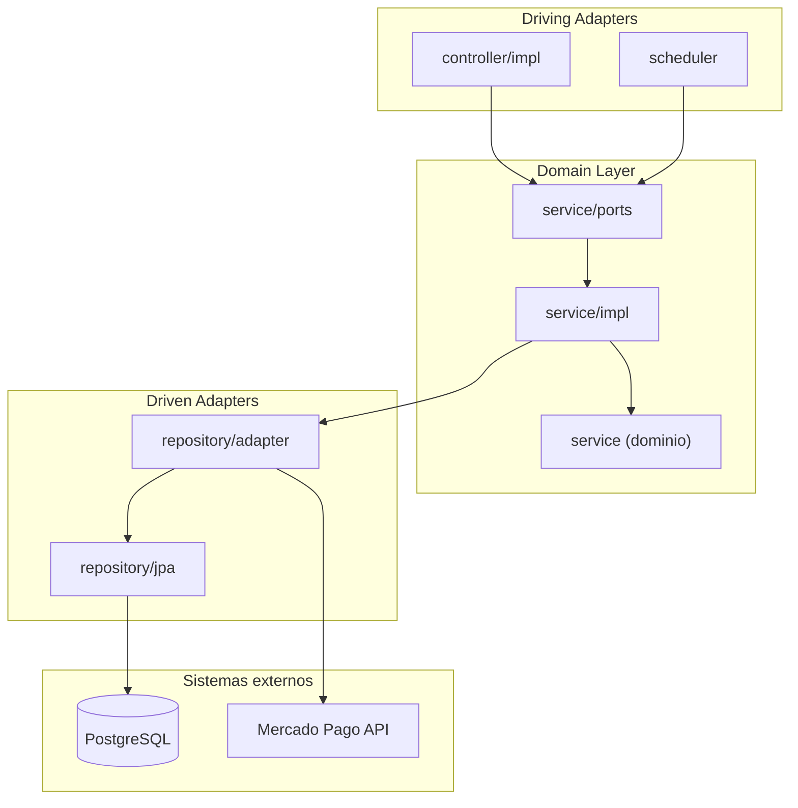
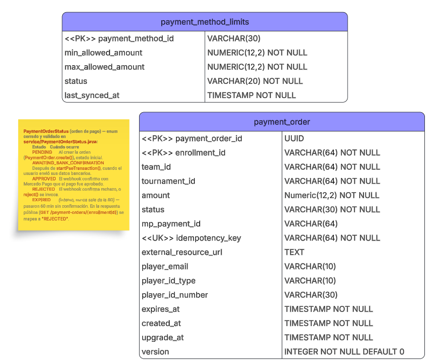

# Arquitectura

## Visión general

El servicio sigue una **arquitectura hexagonal** (Ports & Adapters), separando la lógica de negocio de los detalles de infraestructura.



## Estructura de paquetes

```
src/main/java/co/edu/escuelaing/techcup/payment/
├── config/                     ← CONFIG LAYER (Scheduling, beans de infraestructura)
├── controller/impl/            ← DRIVING ADAPTERS (@RestController)
├── scheduler/                  ← DRIVING ADAPTERS por tiempo (@Scheduled)
├── dto/                        ← DATA TRANSFER OBJECTS
│   ├── request/                (Records for HTTP Requests)
│   └── response/               (Records for HTTP Responses)
├── entity/                     ← PERSISTENCE LAYER (JPA Entities, plano)
├── exception/                  ← SYSTEM EXCEPTIONS
├── mapper/                     ← Clases estáticas: dominio↔entidad, dominio↔DTO
├── repository/                 ← REPOSITORIES & ADAPTERS
│   ├── jpa/                    (Spring Data JpaRepository interfaces)
│   └── adapter/                (Outbound Ports Implementation: JPA + Mercado Pago)
├── service/                    ← DOMAIN / CORE LAYER
│   ├── ports/                  (Inbound/Outbound Interfaces)
│   └── impl/                   (Use Cases and Business Rules)
└── PaymentApplication.java
```

## Responsabilidad por capa

| Capa | Paquete | Responsabilidad |
|------|---------|-----------------|
| Config | `config` | Beans, scheduling, configuración global |
| Driving (HTTP) | `controller/impl` | Exponer endpoints HTTP, validar entrada |
| Driving (cron) | `scheduler` | Disparar casos de uso por tiempo en vez de HTTP |
| DTO | `dto` | Contratos de entrada y salida de la API |
| Entity | `entity` | Modelos de persistencia JPA |
| Exception | `exception` | Excepciones de dominio y manejadores globales |
| Mapper | `mapper` | Conversión entre DTO, dominio y entidades |
| Repository | `repository` | Acceso a datos e implementación de puertos salientes |
| Service | `service` | Reglas de negocio y casos de uso |

## Flujo de una petición

1. El cliente HTTP invoca un endpoint en `controller/impl` (o el cron dispara un job en `scheduler`).
2. El controlador/job delega al puerto de entrada correspondiente en `service/ports` (`XxxUseCase`).
3. `service/impl` ejecuta las reglas de aplicación, delegando las reglas de negocio del agregado al dominio (`service`, paquete raíz).
4. Si se requiere persistencia, se invoca el puerto de salida (`XxxRepositoryPort`) implementado en `repository/adapter`, que usa `repository/jpa` para hablar con PostgreSQL.
5. Si se requiere hablar con Mercado Pago, se invoca `PaymentGatewayPort`, implementado por `MercadoPagoGatewayAdapter` vía `RestClient`.
6. El resultado se mapea a un DTO de respuesta (`mapper/XxxRestMapper`) y se retorna al cliente.

## Principios de diseño

- **Inversión de dependencias**: el dominio no depende de Spring, JPA, ni de HTTP.
- **Single Responsibility**: cada capa tiene una responsabilidad clara.
- **Testabilidad**: los casos de uso se prueban sin levantar el contexto web completo.
- **Evolución independiente**: los adaptadores pueden cambiar sin afectar el dominio.

## Tablas empleadas:

