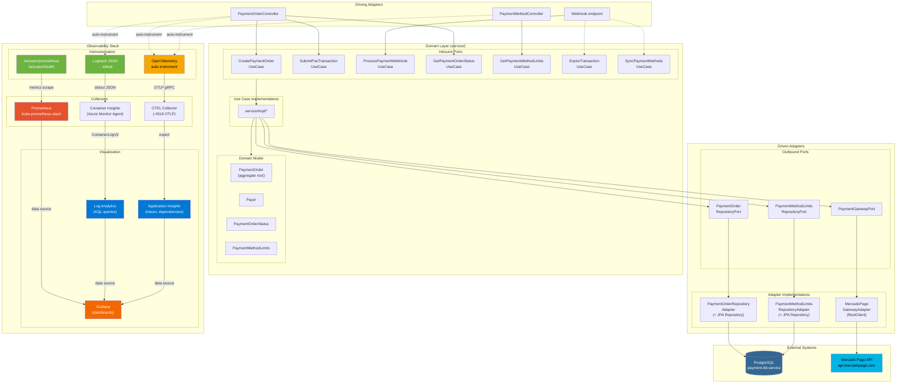

# Diagrama de Componentes Especifico — Payments API

## Leyenda de colores

| Color | Capa |
|---|---|
| Verde | Instrumentacion de la app (Actuator, Logback) |
| Naranja | OpenTelemetry (trazas distribuidas) |
| Rojo | Prometheus (metricas) |
| Naranja oscuro | Grafana (dashboard unificado) |
| Azul | Azure (App Insights + Log Analytics) |

## Flujos de telemetria

1. **Metricas**: `/actuator/prometheus` → Prometheus scrape (30s) → Grafana dashboards
2. **Logs**: stdout JSON estructurado → Container Insights → Log Analytics → consultas KQL / Grafana
3. **Trazas**: OTEL auto-instrument → OTLP (gRPC) → OTEL Collector → Application Insights

## Stack tecnologico de observabilidad

| Componente | Herramienta | Endpoint |
|---|---|---|
| Metricas app | Micrometer + Prometheus registry | `GET /actuator/prometheus` |
| Logging | Logback + Logstash encoder | stdout (JSON) |
| Trazas | OpenTelemetry spring-boot-starter | OTLP → Collector `:4318` |
| Collector | OTEL Collector (contrib) | → App Insights |
| Metricas infra | Node Exporter + kube-state-metrics | → Prometheus |
| Dashboard | Grafana (kube-prometheus-stack) | `http://20.12.84.133/` |
