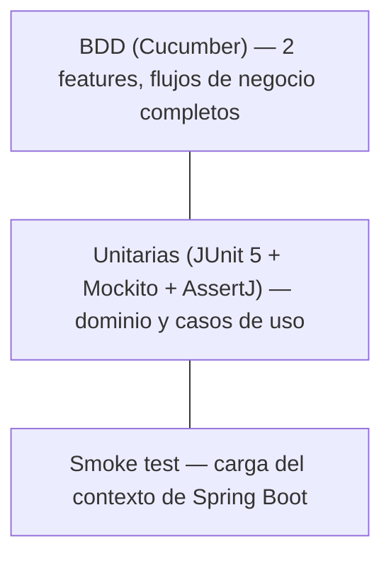

# Pruebas

## Estrategia de testing



| Nivel | Alcance | Herramientas | ¿Levanta Spring? |
|-------|---------|--------------|-------------------|
| Unitarias | `service/` (dominio), `service/impl` (casos de uso), `mapper/` | JUnit 5, Mockito, AssertJ | No |
| BDD | Flujos de negocio completos de cara al consumidor (`CreatePaymentOrder`, `SubmitPseTransaction`) | Cucumber (`cucumber-java` + `cucumber-junit-platform-engine`) | No |
| Smoke | El contexto de Spring Boot arranca correctamente con Spring Data JPA | `@SpringBootTest` | Sí (contra Testcontainers) |

Los tests de `service/impl` **mockean solo los puertos** (`XxxUseCase`, `XxxRepositoryPort`, `PaymentGatewayPort`) — nunca instancian un adaptador real ni levantan contexto de Spring. Los pasos de Cucumber siguen el mismo principio: `new XxxService(mock(Port.class))` directo, sin `cucumber-spring`.

## Base de datos en pruebas

Solo el smoke test (`PaymentApplicationTests`) toca la base de datos. Usa Testcontainers para levantar un contenedor PostgreSQL real vía `@ServiceConnection` — no hay configuración estática de `spring.datasource.*` en `src/test/resources/application.yml`, la URI se inyecta dinámicamente. El resto de las pruebas (unitarias y BDD) no tocan la base de datos: mockean los puertos de salida directamente.

## Ejecución

### Todas las pruebas

```bash
./mvnw test
```

### Build completo (incluye BDD)

```bash
./mvnw verify
```

### Una clase específica

```bash
./mvnw test -Dtest=CreatePaymentOrderServiceTest
```

!!! note "Cobertura (JaCoCo)"
    Aún no está integrado en el `pom.xml`. Pendiente de agregar si el equipo lo requiere para SonarQube.

## Suite actual

**58 pruebas en total**, todas verdes (`./mvnw clean verify`):

### Dominio

| Clase | Cubre |
|-------|-------|
| `PaymentOrderTest` | `create`, `startPseTransaction`, `approve`, `reject`, `expire` (incluida su idempotencia al llamarse dos veces) y `reconstruct` |

### Casos de uso (`service/impl`)

| Clase | Escenarios |
|-------|------------|
| `CreatePaymentOrderServiceTest` | Camino feliz, `AmountOutOfRangeException` (por encima/debajo del rango, sin límites cacheados), `DuplicateEnrollmentOrderException` |
| `SubmitPseTransactionServiceTest` | Camino feliz, `PaymentOrderNotFoundException`, `PaymentOrderNotPendingException`, `PaymentOrderExpiredException` (con y sin conflicto de optimistic locking al persistir la expiración), `PaymentGatewayException` |
| `ProcessPaymentWebhookServiceTest` | Aprobación/rechazo dirigidos solo por `PaymentGatewayPort.getPaymentStatus`, nunca por el body; fallo del gateway, orden no encontrada, notificación duplicada y conflicto de optimistic locking — todos como no-op silencioso |
| `GetPaymentOrderStatusServiceTest` | Camino feliz, `PaymentOrderNotFoundException` |
| `ExpireTransactionServiceTest` | Expira el lote de órdenes vencidas; un conflicto de optimistic locking en una orden no aborta el resto del lote |
| `GetPaymentMethodLimitsServiceTest` | Camino feliz, `PaymentMethodLimitsNotFoundException` |
| `SyncPaymentMethodsServiceTest` | Upsert cuando Mercado Pago devuelve `pse`, no-op cuando no lo devuelve |

### Mappers y contrato

| Clase | Cubre |
|-------|-------|
| `PaymentOrderRestMapperTest` | `EXPIRED` → `"REJECTED"` en la respuesta pública; el resto de estados se serializan tal cual |
| `PaymentOrderStatusResponseContractTest` | El campo `status` se serializa exactamente como lo espera `PaymentServiceClientAdapter` de `mk-tournament-service` |

### BDD (Cucumber)

| Feature | Escenarios |
|---------|------------|
| `create_payment_order.feature` | Crear orden exitosamente, monto fuera de rango, `enrollmentId` duplicado |
| `submit_pse_transaction.feature` | Enviar PSE exitosamente, orden no pendiente, orden expirada, orden inexistente |

### Smoke test

| Clase | Descripción |
|-------|-------------|
| `PaymentApplicationTests` | Verifica que el contexto de Spring Boot carga correctamente (Spring Data JPA contra un contenedor Testcontainers) |

## Buenas prácticas de este proyecto

1. `@Nested` + `@DisplayName` en español describiendo el comportamiento esperado, no el nombre técnico del método.
2. Un test por cada excepción de dominio listada en `SKILL.md` — no se documenta una regla de negocio sin su test correspondiente.
3. Los mocks se configuran por escenario dentro del propio test o step, nunca compartidos entre pruebas.
4. Los pasos de Cucumber reconstruyen el estado con `PaymentOrder.reconstruct(...)` para simular condiciones específicas (por ejemplo, una orden `PENDING` con `expiresAt` en el pasado), no dependen de temporizadores reales.
