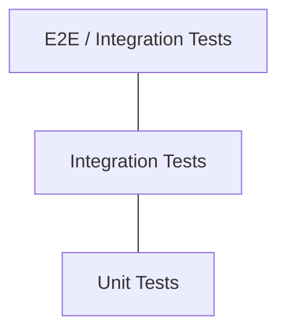

# Pruebas

## Estrategia de testing

El servicio aplica una pirámide de pruebas con tres niveles:



| Nivel | Alcance | Herramientas |
|-------|---------|--------------|
| Unitarias | `service/impl`, mappers, validadores | JUnit 5, Mockito |
| Integración | Repositorios, adaptadores, contexto Spring | Spring Boot Test, Testcontainers |
| E2E | Flujos completos HTTP | MockMvc / RestAssured |

## Ejecución

### Todas las pruebas

```bash
mvn test
```

### Pruebas de un paquete específico

```bash
mvn test -Dtest=PaymentApplicationTests
```

### Con reporte de cobertura

```bash
mvn test jacoco:report
```

!!! note "JaCoCo"
    La integración con JaCoCo se configurará cuando se agregue el plugin al `pom.xml`.

## Pruebas actuales

| Clase | Tipo | Descripción |
|-------|------|-------------|
| `PaymentApplicationTests` | Integración | Verifica que el contexto de Spring Boot carga correctamente |

## Casos de prueba planificados

### Capa de dominio (`service/impl`)

- [ ] Crear pago con datos válidos retorna estado `PENDING`.
- [ ] Crear pago con monto negativo lanza excepción de validación.
- [ ] Actualizar estado de pago inexistente lanza `PaymentNotFoundException`.
- [ ] No se permite transición de `COMPLETED` a `PENDING`.

### Capa de controlador (`controller/impl`)

- [ ] `POST /api/v1/payments` retorna `201` con body válido.
- [ ] `POST /api/v1/payments` retorna `400` con body inválido.
- [ ] `GET /api/v1/payments/{id}` retorna `404` si no existe.

### Capa de repositorio (`repository`)

- [ ] Persistir y recuperar un documento de pago en MongoDB.
- [ ] Consultar pagos por `userId` retorna lista filtrada.

## Buenas prácticas

1. Nombrar tests con el patrón `should{ExpectedBehavior}_when{Condition}`.
2. Usar `@DisplayName` para describir el escenario en lenguaje natural.
3. Aislar la capa de dominio: no levantar el contexto web en tests unitarios.
4. Usar Testcontainers para pruebas de integración con MongoDB real.
