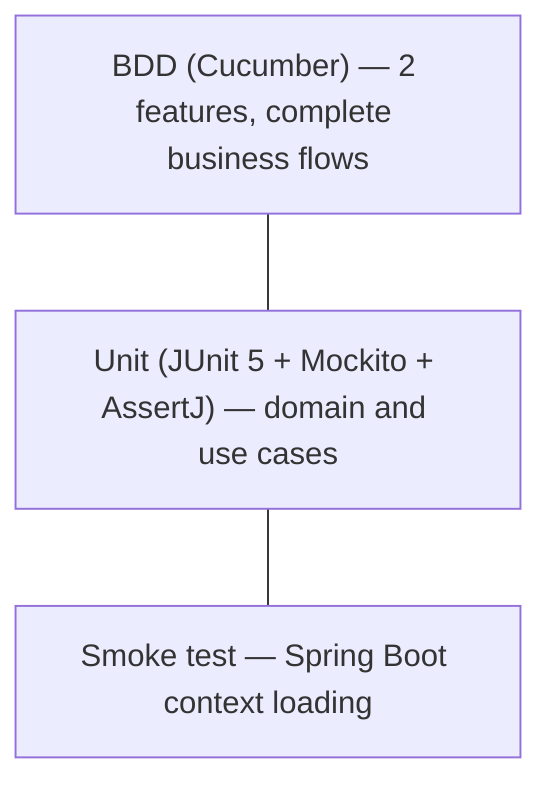

# Testing

## Test Strategy



| Level | Scope | Tools | Starts Spring? |
|-------|-------|-------|----------------|
| Unit | `service/` (domain), `service/impl` (use cases), `mapper/` | JUnit 5, Mockito, AssertJ | No |
| BDD | Complete business flows facing the consumer (`CreatePaymentOrder`, `SubmitPseTransaction`) | Cucumber (`cucumber-java` + `cucumber-junit-platform-engine`) | No |
| Smoke | Spring Boot context loads correctly with Spring Data JPA | `@SpringBootTest` | Yes (against Testcontainers) |

`service/impl` tests **mock only the ports** (`XxxUseCase`, `XxxRepositoryPort`, `PaymentGatewayPort`) — they never instantiate a real adapter or start the Spring context. Cucumber steps follow the same principle: `new XxxService(mock(Port.class))` directly, without `cucumber-spring`.

## Database in Tests

Only the smoke test (`PaymentApplicationTests`) touches the database. It uses Testcontainers to start a real PostgreSQL container via `@ServiceConnection` — there is no static configuration of `spring.datasource.*` in `src/test/resources/application.yml`, the URI is injected dynamically. The remaining tests (unit and BDD) do not touch the database: they mock the output ports directly.

## Execution

### All tests

```bash
./mvnw test
```

### Full build (includes BDD)

```bash
./mvnw verify
```

### Specific class

```bash
./mvnw test -Dtest=CreatePaymentOrderServiceTest
```

!!! note "Coverage (JaCoCo)"
    Already integrated in the `pom.xml`. Reports are generated during the `test` phase and used by SonarQube.

## Current Suite

**58 tests total**, all passing (`./mvnw clean verify`):

### Domain

| Class | Covers |
|-------|--------|
| `PaymentOrderTest` | `create`, `startPseTransaction`, `approve`, `reject`, `expire` (including idempotency when called twice) and `reconstruct` |

### Use Cases (`service/impl`)

| Class | Scenarios |
|-------|-----------|
| `CreatePaymentOrderServiceTest` | Happy path, `AmountOutOfRangeException` (above/below range, no cached limits), `DuplicateEnrollmentOrderException` |
| `SubmitPseTransactionServiceTest` | Happy path, `PaymentOrderNotFoundException`, `PaymentOrderNotPendingException`, `PaymentOrderExpiredException` (with and without optimistic locking conflict on expiration persistence), `PaymentGatewayException` |
| `ProcessPaymentWebhookServiceTest` | Approval/rejection driven solely by `PaymentGatewayPort.getPaymentStatus`, never by the body; gateway failure, order not found, duplicate notification and optimistic locking conflict — all as silent no-op |
| `GetPaymentOrderStatusServiceTest` | Happy path, `PaymentOrderNotFoundException` |
| `ExpireTransactionServiceTest` | Expires the batch of overdue orders; an optimistic locking conflict on one order does not abort the rest of the batch |
| `GetPaymentMethodLimitsServiceTest` | Happy path, `PaymentMethodLimitsNotFoundException` |
| `SyncPaymentMethodsServiceTest` | Upsert when Mercado Pago returns `pse`, no-op when it does not |

### Mappers and Contract

| Class | Covers |
|-------|--------|
| `PaymentOrderRestMapperTest` | `EXPIRED` → `"REJECTED"` in public response; other statuses are serialized as-is |
| `PaymentOrderStatusResponseContractTest` | The `status` field is serialized exactly as `PaymentServiceClientAdapter` in `mk-tournament-service` expects |

### BDD (Cucumber)

| Feature | Scenarios |
|---------|-----------|
| `create_payment_order.feature` | Create order successfully, amount out of range, duplicate `enrollmentId` |
| `submit_pse_transaction.feature` | Submit PSE successfully, order not pending, order expired, order not found |

### Smoke Test

| Class | Description |
|-------|-------------|
| `PaymentApplicationTests` | Verifies that the Spring Boot context loads correctly (Spring Data JPA against a Testcontainers container) |

## Best Practices in This Project

1. `@Nested` + `@DisplayName` in Spanish describing the expected behavior, not the technical method name.
2. One test per domain exception listed in `SKILL.md` — no business rule is documented without its corresponding test.
3. Mocks are configured per scenario within the test or step, never shared between tests.
4. Cucumber steps reconstruct state with `PaymentOrder.reconstruct(...)` to simulate specific conditions (e.g., a `PENDING` order with `expiresAt` in the past), rather than relying on real timers.
